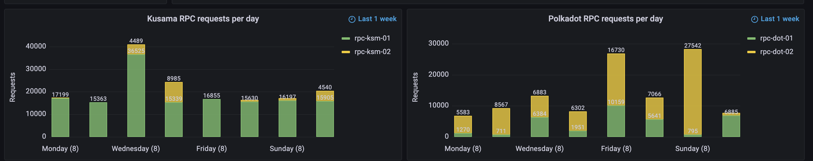

# Proposal: Stakeworld maintenance of snapshot services and rpc nodes Q1 2023

Proponent: Et9M3rrA7H2kHQEGRXHxufcp9HTEmFirMWtKHvjoJ85r1C9 (identity: Stakeworld.io)

Requested KSM: To be calculated on day of submission

## Description

This request is for funding maintenace of:

* RPC services for kusama and polkadot
* Snapshot services for kusaama and polkadot

## Context/problem/solution

### RPC nodes
RPC nodes are an essential part of the kusama/polkadot ecosystem since they give the possibility to interact with the chain. Stakeworld started with 2 (pruned) public RPC servers which were originally deployed for internal use. In Q4 2022 we decided to become more active, switched to archive nodes and added two more nodes for balancing/failover. We did some more [research and stress testing](https://stakeworld.io/docs/rpc) and rewrote the [wiki page](https://wiki.polkadot.network/docs/maintain-wss). The service has found public usage (see metrics) and we created a [pull request](https://github.com/polkadot-js/apps/pull/8227) for inclusion in the polkadot.js app, which unfortunately has not been pushed yet. 

### Snapshot services
While setting up nodes for Stakeworld's services we often used snapshot services like polkachu or polkashots. Sometimes for testing or setting up a new node, also in the case of a database corruption or other database problems a quick database restore is needed. While using these services there where sometimes problems like non working links or slow connections. From the ideas of decentralisation and strengthening the ecosystem through multiple providers we thought it would be beneficial to add an extra [snapshot service](https://stakeworld.io/snapshot). We started with the paritydb database format and later also added rocksdb format snapshots. 

The snapshot service also includes a simple one-line install script which can restore a database, or even can install a complete node including snapshot with a simple command line installer.

```bash
curl -o- -L https://raw.githubusercontent.com/stakeworld/stakeworld-scripts/master/node-install.sh | bash
```


#### Technical
The RPC services are hosted on multiple dedicated servers on different locations with nodes running in archive mode and rpc requests proxied by ssl enabled apache2 instances. For each network (polkadot and kusama for now) there are two nodes active for rendundancy which are load balanced by cloudflare services.  

The snapshot service is hosted on a dedicated server, with unlimited traffic and a 1 Gbit network link. Every day the databases are compressed and saved with an [open source crontab script](https://github.com/stakeworld/stakeworld-website/blob/master/scripts/snapshot.sh). Occasionaly we start with a freshly synced database to reduce disk space an prevent errors. The script also registers blockheight, full and compressed datasizes, creates a gnuplot image and puts it all on the [website](https://stakeworld.io/snapshot). 

All servers are monitored with grafana and alert mechanisms are in place. We keep a [statuspage](https://stakeworld.statuspage.io/). The snapshot service sometimes has some maintenance for rebuilding snapshots, we had no major outages on the rpc or snapshot service. 

#### Metrics

##### Snapshot service

Excluding bots and our own servers below some statistics about the snapshot service starting from january 2023 untill now.


##### Rpc

Below some usage of our rpc service. Unfortunately older data usage was lost as a result of a changed retention policy in an updated prometheus binary. We are now using mimir as a database backend for data retention, so older data will stay available.



 
#### Publicity

There is some exposure through the kusama and polkadot validator pages on element and we are trying to include the rpc on the polkadot.js website ([pull request](https://github.com/polkadot-js/apps/pull/8227)). 

## Financial

### Expenses
This request is for 3 months of maintenance in Q1 2023.

Hours are included at a 80 EUR/hour rate.

| Item                  | Cost                   		|
| RPC nodes		|			 		|
| Maintenance           | 3 months x 5 h x 80 EUR = 1200 EUR  	|
| Hosting		| 3 months x 560 EUR = 1680 EUR 	|
| Snapshot service	|			 		|
| Maintenance           | 3 months x 4 h x 80 EUR = 960 EUR  	|
| Hosting               | 3 months x 160 EUR = 480 EUR 		|
| TOTAL                 | EUR 4320 		 		|
| REQUEST		| To be calculated on day of submission |

For simplicity treasury requests for our services will only be done on kusama.
