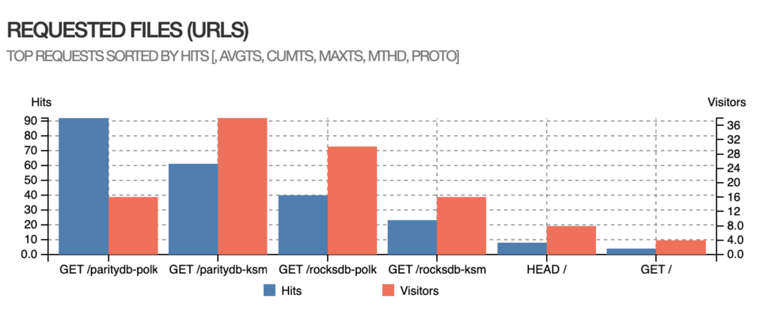

# Proposal: Stakeworld maintenance of Kusama snapshot services and Kusama and Westend rpc nodes, introducing bootnodes - Q2 2023

Proponent: Et9M3rrA7H2kHQEGRXHxufcp9HTEmFirMWtKHvjoJ85r1C9 (identity: Stakeworld.io)

Requested KSM: 668

## Description

This request is for funding of:

* Setup and maintaining [RPC services](https://stakeworld.io/docs/rpc) for kusama and westend
* Setting up and maintaining [bootnodes](https://stakeworld.io/docs/bootnode) for kusama and westend
* Maintenance of [database snapshot services](https://stakeworld.io/docs/snapshot) for kusama
* Contributions to the wiki with instructions about setting up [bootnodes](https://github.com/w3f/polkadot-wiki/pull/4742) and [rpc/wss](https://github.com/w3f/polkadot-wiki/pull/4223).
* Maintaining a [node installer script](https://raw.githubusercontent.com/stakeworld/stakeworld-scripts/master/node-install.sh) and a [database size history page](https://stakeworld.io/docs/dbsize).

[Previous requests](https://github.com/stakeworld/stakeworld-treasury#readme) were made through the Infrastructure Maintenance Bounty, which was recently [ended](https://kusama.polkassembly.io/referenda/171) so this request will be through an Opengov request. The Infrastructure Maintenance Bounty was strictly for maintenance and didn't allow requests for setting up services, so some RPC setup cost are included in this request. Snapshot setup was already covered in a previous treasury tip request. 

Comparable proposals: [Dwellir RPC service](https://kusama.polkassembly.io/referenda/176), [Onfinality High Performance Infrastructure](https://kusama.subsquare.io/polkassembly/post/2568)

## Context/problem/solution

### RPC nodes
RPC nodes are an essential part of the kusama/polkadot ecosystem since they give the possibility to interact with the chain. Stakeworld started with pruned RPC servers, for polkadot and kusama, which were originally deployed for internal use. In Q4 2022 we decided to become more active and public, switched to archive nodes and added more nodes for loadbalancing/failover. We did some more [research and stress testing](https://stakeworld.io/docs/rpc), rewrote the [wiki page](https://wiki.polkadot.network/docs/maintain-wss) and also included westend RPC nodes. In Q2 2023 our polkadot, kusama and westend nodes got included in polkadot.js and we expanded our infrastructure to match the higher demand, at this moment we are serving public RPC requests for kusma, polkadot and westend. This request is for the kusama and westend infrastructure.

### Snapshot services
While setting up nodes for Stakeworld's services we often used snapshot services like polkachu or polkashots. Sometimes for testing or setting up a new node, also in the case of a database corruption or other database problems a quick database restore is needed. While using these services there where sometimes problems like non working links or slow connections. From the ideas of decentralisation and strengthening the ecosystem through multiple providers we thought it would be beneficial to add an extra [snapshot service](https://stakeworld.io/snapshot).

The snapshot service also includes a simple one-line install script which can restore a database, or can install a complete node including snapshot with a simple command line installer. The site also keeps a [database size history](https://stakeworld.io/docs/dbsize).

```bash
curl -o- -L https://raw.githubusercontent.com/stakeworld/stakeworld-scripts/master/node-install.sh | bash
```


Possibly in the future the snapshot service will be no longer needed as "warp sync" is getting more and more popular. Downside of warp sync is that although the node is in state-sync quickly on the background it still has to download the previous blocks, which takes some time and strain on the server resources. At this moment the service still seems popular but we will monitor this development and if snapshots become absolete retire the snapshot service. 

### Boot nodes

Recently we have setup bootnodes for kusama, polkadot and westend. We wrote a [writeup](https://stakeworld.io/docs/bootnode) about our experiences which we also published to the [polkadot wiki](https://github.com/w3f/polkadot-wiki/pull/4742). Our bootnodes were recently [included](https://github.com/paritytech/polkadot/pull/7148) in the polkadot source code. 

#### Technical
The RPC nodes are hosted on dedicated servers, on different geographical locations, with nodes running in archive mode and rpc requests proxied by ssl enabled nginx instances. Nodes are load balanced by cloudflare services. Usage is monitored and in case of capacity problems extra nodes can be added in a short time.  

The snapshot service is hosted on a dedicated server, every day the databases are compressed and saved with an [open source crontab script](https://github.com/stakeworld/stakeworld-website/blob/master/scripts/snapshot.sh). Occasionaly we start with a freshly synced database to prevent errors. The script also registers blockheight, full and compressed datasizes, creates a gnuplot image and puts it all on the [website](https://stakeworld.io/snapshot). 

All servers are monitored with grafana and alert mechanisms are in place. We keep a [statuspage](https://stakeworld.statuspage.io/). The snapshot service sometimes has some maintenance for rebuilding snapshots, we had no major outages on the rpc, bootnode or snapshot services. 

#### Metrics

##### Snapshot service

Excluding bots and our own servers below some statistics about the snapshot service starting from march 2023 untill now.




##### Rpc

Below some usage of our rpc service. Live data can be seen on our [webpage](https://stakeworld.io/docs/rpc#live-stakeworld-rpc-data).

Requests on the kusama chain:


#### Publicity

There is exposure through the kusama and polkadot validator pages on element and some traffic from google search. Polkadot, kusama and westend RPC's are included on polkadot.js so generate a lot of traffic from there. .

## Financial

### Expenses
This request is for 3 months of maintenance in Q2 2023 and for the setup of some services.

| Item                                  | Cost                   		|
| ------------                          | -----------------------               |
| **Kusama/westend RPC nodes**	 	                |			 		|
| Setup, stress testing, updating wiki  | 20 h x 85 EUR = 1700 EUR              |
| Maintenance                           | 3 months x 12 h x 85 EUR = 3060 EUR  	|
| Dedicated nodes kusama                | 7200 EUR 	|
| Dedicated nodes westend               | 560 EUR 	|
| **Snapshot service**	                |			 		|
| Maintenance                           | 3 months x 4 h x 85 EUR = 1020 EUR  	|
| Hosting                               | 800 EUR 		|
| **Bootnodes**	                        |			 		|
| Setup, testing, updating wiki         | 10 h x 85 EUR = 850 EUR                       |
| Maintenance                           | 3 months x 3 h x 85 EUR = 765 EUR  	|
| Dedicated nodes kusama and westend    | 600 EUR 		|
| TOTAL                                 | 16555  EUR	 		|
| REQUEST		                | 16555 EUR = 18160 USD / 27.16 ([EMA7](https://kusama.subscan.io/tools/charts?type=price)) = 668 KSM  |

