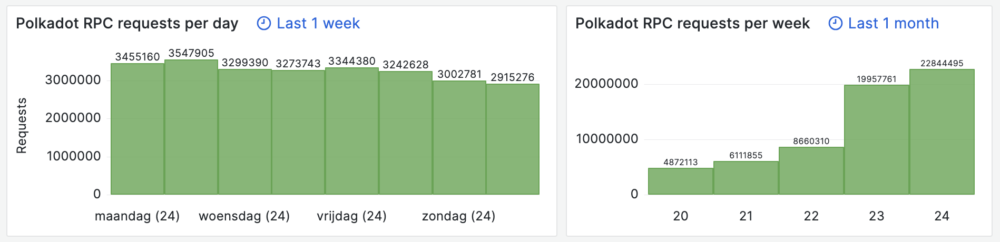
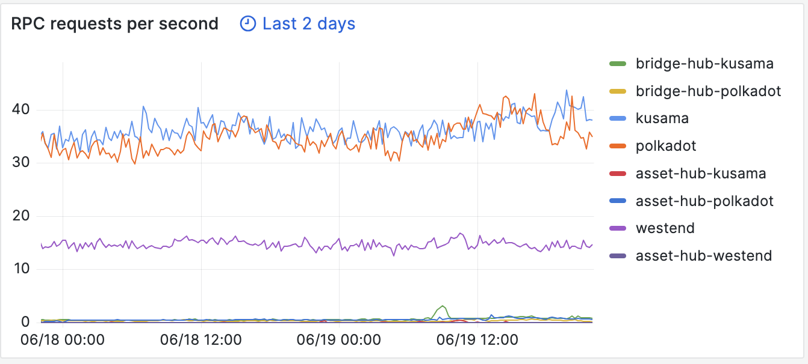
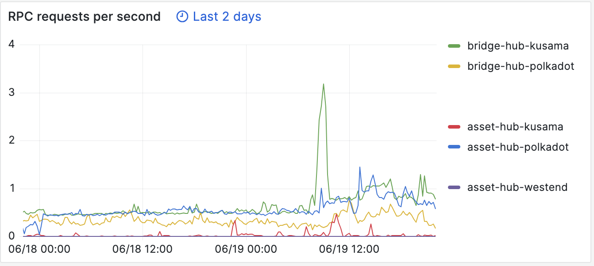

# Proposal: Stakeworld polkadot RPC and bootnode high availability infrastructure - Q2 2023

Proponent: 13Jpq4n3PXXaSAbJTMmFD78mXAzs8PzgUUQd5ve8saw7HQS5 (identity: Stakeworld.io)

Requested DOT: 3469

## Description

This is a request for funding of:

* Setting up and maintaining high availability [RPC services](https://stakeworld.io/docs/rpc) for polkadot and polkadot commons (AssetHub, BridgeHub and Collectives).
* Setting up and maintaining a [bootnode](https://stakeworld.io/docs/bootnode) for polkadot.

Services provided but not included in this request:

* Maintenance of [database snapshot services](https://stakeworld.io/docs/snapshot); this was previously covered in a [kusama treasury request](https://kusama.polkassembly.io/treasury/313). Snapshots will be deprecated in the near future in favor of warp sync but are still used sporadically so we decided to keep the service up for a little longer with our own resources.

* Maintaining a [node installer script](https://raw.githubusercontent.com/stakeworld/stakeworld-scripts/master/node-install.sh) and a [database size history page](https://stakeworld.io/docs/dbsize) including polkadot and polkadot commons database sizes.

[Previous requests](https://github.com/stakeworld/stakeworld-treasury#readme) were made through the Kusama Infrastructure Maintenance Bounty, which was recently [ended](https://kusama.polkassembly.io/referenda/171). For Q2 2023 a [Kusama Opengov request](https://kusama.polkassembly.io/treasury/313) was requested (and awarded) for kusama related rpc and bootnode services.

Comparable proposals: [Onfinality High Performance Public Infrastructure](https://polkadot.polkassembly.io/treasury/287), [Dwellir Polkadot RPC services Dwellir Q2 2023](https://polkadot.polkassembly.io/post/1773) 

## Context/problem/solution

### RPC nodes
RPC nodes are an essential part of the kusama/polkadot ecosystem since they give the possibility to interact with the chain. Stakeworld started with pruned RPC servers for polkadot and kusama, which were originally deployed for internal use. In Q4 2022 we decided to become more active and public, switched to archive nodes and added more nodes for loadbalancing/failover. We did some more [research and stress testing](https://stakeworld.io/docs/rpc), rewrote the [wiki page](https://wiki.polkadot.network/docs/maintain-wss) and also included the common chains (AssetHub, BridgeHub and Collectives). In Q2 2023 our polkadot, kusama and westend nodes got included in polkadot.js and a bit later also the common chains. We expanded our infrastructure to match the higher demand after inclusion. At this moment we are serving public RPC requests for kusama (including AssetHub and BridgeHub), polkadot (including AssetHub, BridgeHub and Collectives) and westend (including AssetHub). This request is for the polkadot infrastructure.

There is some discussion about rpc nodes versus using light clients. Stakeworld also offers light node connectivity through it's RPC servers but in our view at this moment RPC nodes are still necessary in the polkadot ecosystem.
   
### Boot nodes

We have setup bootnodes for kusama, polkadot and westend. We wrote a [writeup](https://stakeworld.io/docs/bootnode) about our experiences which we also published to the [polkadot wiki](https://github.com/w3f/polkadot-wiki/pull/4742). Our bootnodes were [included](https://github.com/paritytech/polkadot/pull/7148) in the polkadot source code. 

#### Technical

The RPC nodes are hosted on dedicated servers, on different geographical locations, with nodes running in archive mode and rpc requests proxied by ssl enabled nginx instances. Nodes are load balanced by cloudflare services with automatic failover in case of outages. Usage is monitored and in case of capacity problems extra nodes can be added in a short time.  
All servers are monitored with grafana and alert mechanisms are in place. We keep a [statuspage](https://stakeworld.statuspage.io/). 

In the previous months we have had two node failures (one defective PSU and one unknown server failure), failover quickly excluded the faulty servers so there was no impact on user experience (except possibly some retries and slower response times). There were no failures in the bootnode services. 

#### Metrics

Below some usage of our rpc service. Live data can be seen on our [webpage](https://stakeworld.io/docs/rpc#live-stakeworld-rpc-data).

Requests on the polkadot chain:

#### Publicity

There is exposure through the kusama and polkadot validator pages on element but most traffic is generated from inclusion on polkadot.js.

## Financial

### Expenses
This request is for 3 months of maintenance in Q2 2023 and for the setup of some services.

Hours are included at a 85 EUR/hour rate.

| Item                                  | Cost                   		|
| ------------                          | -----------------------               |
| **Polkadot/commons RPC nodes**        |			 		|
| Setup                                 | 12 h x 85 EUR = 1020 EUR              |
| Maintenance                           | 3 months x 12 h x 85 EUR = 3060 EUR  	|
| Dedicated nodes polkadot              | 7200 EUR 	                        |
| Dedicated nodes polkadot commons      | 1120 EUR                      	|
| Cloudflare service costs              | 300 EUR                        	|
| **Bootnode**	                        |			 		|
| Setup, testing                        | 5 h x 85 EUR = 425 EUR                |
| Maintenance                           | 3 months x 3 h x 85 EUR = 765 EUR  	|
| Dedicated node polkadot               | 560 EUR 	      	                |
| TOTAL                                 | 14450 EUR	 		        |
| REQUEST		                | 14450 EUR = 15782 USD / 4.55 ([EMA7](https://polkadot.subscan.io/tools/charts?type=price)) = 3469 DOT  |

