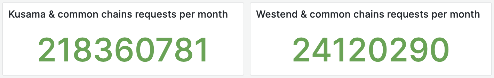

# Proposal: [rpc services](https://stakeworld.io/docs/rpc) for kusama, westend and encointer including the commons in Q3 2023.

Proponent: Et9M3rrA7H2kHQEGRXHxufcp9HTEmFirMWtKHvjoJ85r1C9 (identity: Stakeworld.io)

Requested ksm: 467 

## Description

This is a request for the retroactive funding of maintaining public [rpc services](https://stakeworld.io/docs/rpc) in Q3 2023 for kusama, westend and encointer including the commons (assethub, bridgehub), all included in [polkadot.js.org](https://polkadot.js.org/apps/?rpc=wss://ksm-rpc.stakeworld.io).

Infrastructure requests are a hot topic on the kusama treasury. Stakeworld is an active participant in the kusama ecosystem, active as a validator (also in the thousand validator group) as well as running collators, making updates to the wiki, running bootnodes and maintaining robust rpc public endpoints. Especially the rpc endpoints cannot be maintained without adequate funding. 

In the previous 30 days we [served](https://stakeworld.io/docs/rpc#live-stakeworld-rpc-data):
* 218.360.781 Kusama & common chains rpc requests (including encointer)
* 24.120.290 Westend & common chains rpc requests

Earlier requests can be found [here](https://github.com/stakeworld/stakeworld-treasury#readme) and have also been rewarded via the [ended](https://kusama.polkassembly.io/referenda/171) Infrastructure Maintenance Bounty.
 
Comparable proposals: [Dwellir RPC service](https://kusama.polkassembly.io/treasury/333), [Onfinality High Performance Infrastructure](https://kusama.polkassembly.io/treasury/311)

## Context

### rpc nodes

Stakeworld has been publicly active as a public rpc provider since the end of 2022. We did some [research and stress testing](https://stakeworld.io/docs/rpc), rewrote the [wiki page](https://wiki.polkadot.network/docs/maintain-wss) and in Q2 2023 our polkadot, kusama and westend endpoints including the commons got included in polkadot.js and we expanded our infrastructure to match the higher demand. Since then we have been serving public rpc requests without any outage. 

All the rpc endpoints are included on polkadot.js which generates most of the rpc traffic. After our [rejected](https://kusama.polkassembly.io/referenda/242) (prefunded) request we scaled down a little and delayed adding ourself to more services like polkassembly and the staking dashboard until it is clear if the kusama community thinks our service deserves further funding. 

#### Technical

The rpc nodes are hosted on dedicated servers, in different geographical locations, with nodes running in archive mode and rpc requests proxied by ssl enabled nginx instances. Nodes are load balanced by cloudflare services, including automatic failover in case of outages. Usage is monitored and in case of capacity problems extra nodes can be added in a short time.  

All servers are monitored with grafana and alert mechanisms are in place. We keep a [statuspage](https://stakeworld.statuspage.io/). We have had no major outages. 

#### Statistics

Live data can be seen on our [webpage](https://stakeworld.io/docs/rpc#live-stakeworld-rpc-data).

## Financial

### Expenses

This request is for 3 months of maintenance in Q3 2023.

Hours are included at a 85 EUR/hour rate.

| Item                                  | Cost                   		|
| ------------                          | -----------------------               |
| **rpc nodes**	 	                |			 		|
| Maintenance                           | 3 months x 10 h x 85 EUR = 2550 EUR  	|
| Dedicated nodes kusama                | 4320 EUR 	                        |
| Dedicated nodes westend               | 540 EUR 	                        |
| Dedicated nodes commons               | 720 EUR 	                        |
|                                       |                                       |
| Total                                 | 8130 EUR	 		        |
| Request		                | 8130 EUR * 1.06 = 8618 USD / 18,44	 ([EMA7](https://kusama.subscan.io/tools/charts?type=price)) = 467 KSM  |

