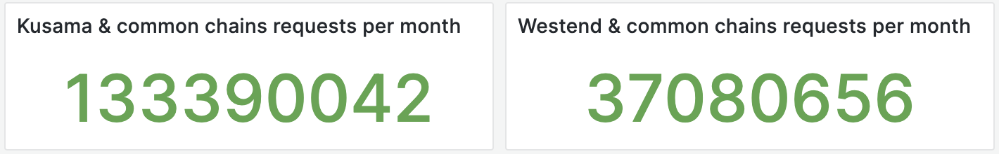
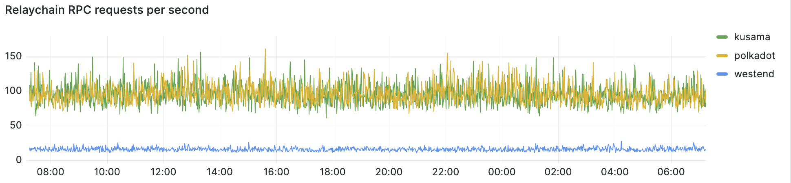
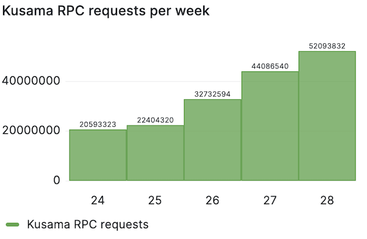
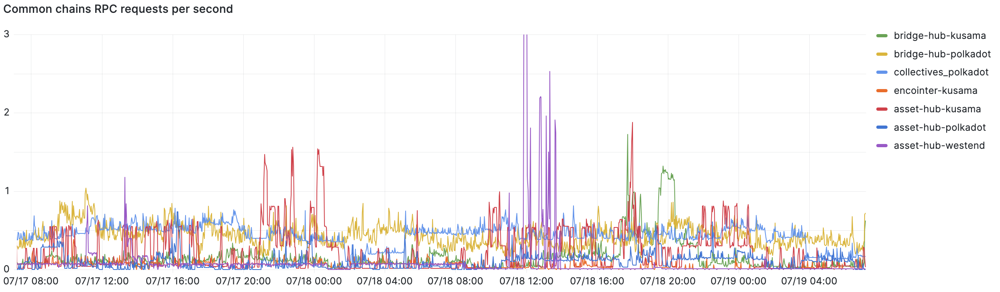

# Proposal: maintaining high availability [rpc services](https://stakeworld.io/docs/rpc) for kusama, kusama commons (assethub, bridgehub), encointer, westend and westend commons (assethub) in Q3 2023.

Proponent: Et9M3rrA7H2kHQEGRXHxufcp9HTEmFirMWtKHvjoJ85r1C9 (identity: Stakeworld.io)

Requested KSM: 609

## Description

This request is for funding of:

* Maintaining public [RPC services](https://stakeworld.io/docs/rpc) for kusama, kusama commons (assethub, bridgehub), encointer, westend and westend assethub (all included in [polkadot.js.org](https://polkadot.js.org/apps/?rpc=wss://ksm-rpc.stakeworld.io))
* Maintaining [bootnodes](https://stakeworld.io/docs/bootnode) for kusama and westend

In the previous 30 days we served:
* 133.390.042 Kusama & common chains RPC requests
* 37.080.656 Westend & common chains RPC requests

Live data can be seen on our [webpage](https://stakeworld.io/docs/rpc#live-stakeworld-rpc-data). 

It is a follow-up of our [previous opengov](https://kusama.polkassembly.io/referenda/189) and [earlier](https://github.com/stakeworld/stakeworld-treasury#readme) [ended](https://kusama.polkassembly.io/referenda/171) Infrastructure Maintenance Bounty requests. 

Previous request were more post funded (requested at the end or after a period) while this one is more pre funded (at the beginning of the period). Main reason for this is that there seems to be a sentiment against spendings of the treasuries in general (HACNA) and also some discussion about rpc node funding; how many providers do we need, are we going more to a light node enviroment without rpc servers? We would like to have some clarity of our funding in the light of planning our resources. For example [database sizes](https://stakeworld.io/docs/dbsize) of archive nodes are growing fastly, we need to deploy extra servers in case the load of our servers gets too high, etc.  

We believe that:
* we provide a valuable service to the community with a reasonable funding
* at this moment rpc services are still needed because accessing the network by light nodes is not very functional/mainstream yet
* it is good to have diversity in providers and also smaller rpc providers should have a place in the ecosystem
* our track record is long enough to earn some trust that we will use pre-funding in a responsible way

Comparable proposals: [Dwellir RPC service](https://kusama.polkassembly.io/referenda/176), [Onfinality High Performance Infrastructure](https://kusama.subsquare.io/polkassembly/post/2568)

## Context

### RPC nodes
RPC nodes are an essential part of the kusama/polkadot ecosystem since they give the possibility to interact with the chain. Stakeworld started with pruned RPC servers, for polkadot and kusama, which were originally deployed for internal use. In Q4 2022 we decided to become more active and public, switched to archive nodes and added more nodes for loadbalancing/failover. We did some more [research and stress testing](https://stakeworld.io/docs/rpc), rewrote the [wiki page](https://wiki.polkadot.network/docs/maintain-wss) and also included westend RPC nodes. In Q2 2023 our polkadot, kusama and westend nodes got included in polkadot.js and we expanded our infrastructure to match the higher demand. At the end of Q2 we added the kusama commons (assethub, bridgehub) including encointer. At this moment we are serving public RPC requests for kusma, polkadot and westend, including all the commons and encointer.

### Boot nodes

We run bootnodes for kusama, polkadot and westend. We wrote a [writeup](https://stakeworld.io/docs/bootnode) about our experiences which we also published to the [polkadot wiki](https://github.com/w3f/polkadot-wiki/pull/4742). Our bootnodes are [included](https://github.com/paritytech/polkadot/pull/7148) in the polkadot source code. 

### Services not included in this proposal

* Previously we also offered [snapshot services](https://stakeworld.io/docs/snapshot), which are being outfased with the rise of warp sync. We still keep some snapshots but stopped updating them on a regular basis to save resources
* We maintain a daily updated [database sizes](https://stakeworld.io/docs/dbsize) page with all the different database sizes
 
#### Technical

The RPC nodes are hosted on dedicated servers, in different geographical locations, with nodes running in archive mode and rpc requests proxied by ssl enabled nginx instances. Nodes are load balanced by cloudflare services, including automatic failover in case of outages. Usage is monitored and in case of capacity problems extra nodes can be added in a short time.  

All servers are monitored with grafana and alert mechanisms are in place. We keep a [statuspage](https://stakeworld.statuspage.io/). We had no major outages on the rpc and bootnode services. 

#### Statistics

Live data can be seen on our [webpage](https://stakeworld.io/docs/rpc#live-stakeworld-rpc-data).

#### Publicity

There is exposure through the kusama and polkadot validator pages on element and some traffic from search engines. All the rpc endpoints are included on polkadot.js which generates most of the RPC traffic. We are adding ourself to more services like [polkassembly](https://github.com/Premiurly/polkassembly/pull/383) to extend our usage.

## Financial

### Expenses

This request is for 3 months of maintenance in Q3 2023.

Hours are included at a 85 EUR/hour rate.

| Item                                  | Cost                   		|
| ------------                          | -----------------------               |
| **RPC nodes**	 	                |			 		|
| Maintenance                           | 3 months x 12 h x 85 EUR = 3060 EUR  	|
| Dedicated nodes kusama                | 7200 EUR 	                        |
| Dedicated nodes westend               | 560 EUR 	                        |
| Dedicated nodes commons               | 1120 EUR 	                        |
| **Bootnodes**	                        |			 		|
| Maintenance                           | 3 months x 3 h x 85 EUR = 765 EUR  	|
| Dedicated nodes kusama/westend        | 560 EUR 		                |
|                                       |                                       |
| Total                                 | 13265 EUR	 		        |
| Request		                | 13265 EUR = 14892 USD / 24.43	 ([EMA7](https://kusama.subscan.io/tools/charts?type=price)) = 609 KSM  |

