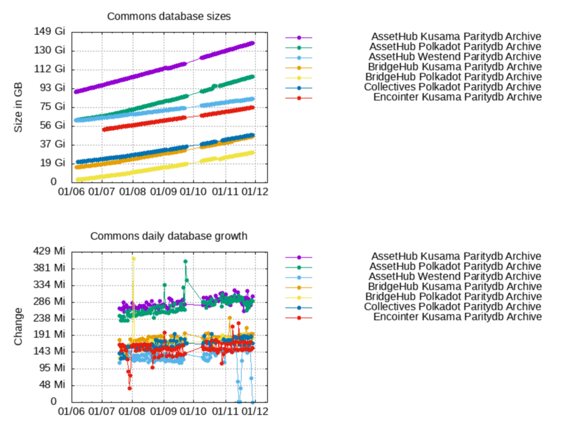

# Proposal:  Maintaining services for kusama in Q4 2023.

Proponent: Et9M3rrA7H2kHQEGRXHxufcp9HTEmFirMWtKHvjoJ85r1C9 (identity: Stakeworld.io)

Requested KSM: 105 

## Description

Stakeworld maintains a few services which are connected to it's rpc services. For example we keep a [database size overview](https://stakeworld.io/docs/dbsize) which gets its size information from the archive rpc nodes. Since the last treasury requests for rpc services did not get through we plan to scale down/stop these services, which would also mean we have to stop with the database size overview service. We would like to continue this service but will need some funding for this.

Also we revived our [snapshot](2023-Q4-dbsize.png) service. The service was still online but not being updated anymore. Since it was getting used more and more again in light of the recent beefy introduction which disables warp sync and refers to our snapshot service as a solution (for the time being) we refreshed our snapshots to more current state and after discussions on element are also considering including rocksdb again. This will probably be only for a few months untill warp sync gets re-enabled with beefy. 
     
### Expenses

This request is for 3 months of maintaining services in Q3 2023/Q1 2024.

Hours are included at a 85 EUR/hour rate.

| Item                                  | Cost                   		|
| ------------                          | -----------------------               |
| Maintenance                           | 3 months x 4h x 85 EUR = 1020 EUR  	|
| Archive nodes kusama/commons          | 720 EUR 	                        |
| Snapshot node/server                  | 600 EUR 	                        |
|                                       |                                       |
| Total                                 | 2340 EUR	 		        |
| Request		                | 2340 EUR * 1.10 = 2574 USD / 24.62 ([EMA7](https://polkadot.subscan.io/tools/charts?type=price)) = 105 KSM |

