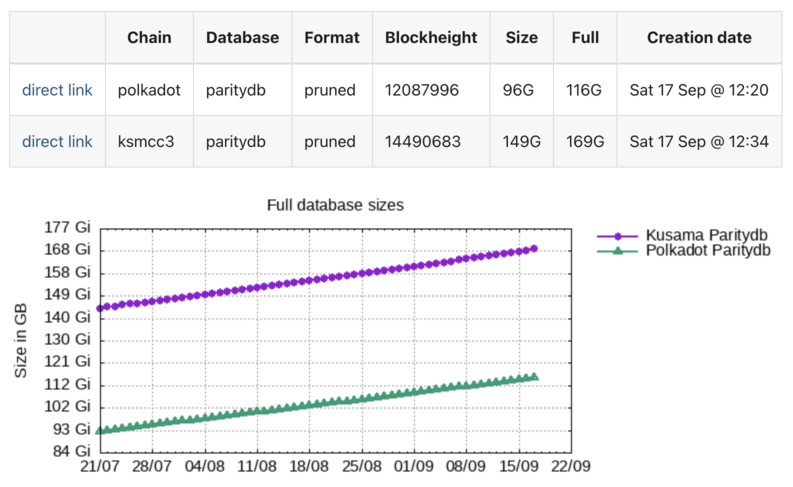

# Proposal: STAKEWORLD snapshot/install service setup and maintenance Q3

Proponent: Et9M3rrA7H2kHQEGRXHxufcp9HTEmFirMWtKHvjoJ85r1C9 (identity: STAKEWORLD)

Date: 28.09.2022

Requested KSM: 51 KSM (to be updated at submission)

## Description
In juli 2022 STAKEWORLD started a paritydb snapshot service to provide an extra service to the kusama/polkadot community. Originally it was only a snapshot service, later an easy polkadot node install script and snapshot restore script were added, alongside a database size tracker on the website.

## Context/problem/solution

### Snapshot service
While setting up nodes for STAKEWORLD's services we often used snapshot services like polkachu or polkashots. Sometimes for testing or setting up a new node, also in the case of a database corruption or other problems a quick database restore is needed. While using these services there where some problems like non working links or slow connections. From the ideas of decentralisation and strengthening the ecosystem through multiple providers we thought it would be beneficial to add an extra [snapshot service](https://stakeworld.nl/docs/snapshot). Also in the thousand validators group, in which we participate, it is encouraged to provide services to the community, like snapshot services, rpc servers, etc. 

In the beginning we also included rocksdb in the snapshot service but to reduce space and for simplicity at this moment only paritydb format is offered. Although not yet being the standard, we believe this will be the standard in the future. 

### Database size history
We also keep track of the database sizes and represent that in a graph. 



### Install/restore script
There are ansible scripts for installing a node but we think a simple one-line install script is more attractive so we also added an easy installer script which can restore a database, or even can install a complete node including snapshot with a simple command line installer. 

```bash
curl -o- -L https://raw.githubusercontent.com/stakeworld/stakeworld-scripts/master/node-install.sh | bash
```


### Open source
All the scripts and website sources are open source. [Github](https://github.com/stakeworld/)

## Technical
The snapshot service is hosted on a dedicated server in Finland, with unlimited traffic, RAID protection and a 1 GB network link. The server is monitored for (db) errors, network problems and other issues and every day the database is compressed and saved with an [open source script](https://github.com/stakeworld/stakeworld-website/blob/master/scripts/snapshot.sh). The script also registers blockheight, full and compressed datasizes, puts them in a text file and creates a gnuplot image and puts it all on the [website](https://stakeworld.nl/snapshot).

Rocksdb support is included in the script but for now not used. 

## Usage
Due to a new server the download logfiles are available starting from 27/08/2022. Parsing the log files and excluding our own ip's in the last month there were 7 unique visitors downloading the polkadot snapshot and 10 unique visitors downloading the kusama snapshot.


## Publicity
Main publicity is through the kusama and polkadot validator pages on element. We try to drop the snapshot website or install script when there are questions with a relation to this and are actively participating on these forums.  

Also we made a wiki pull request to include ourself in the snapshot providers on the [how-to-validate](https://guide.kusama.network/docs/maintain-guides-how-to-validate-polkadot/) wiki page, which was accepted and is now online.

The website is SEO friendly and is findable in google searches, although not as high as longer existing snapshot providers. Hopefully the rank will increase in the future.

## Future
If the treasury request is approved we will continue with this service and will also explore adding other services like RPC nodes, bootnodes etc. Also we will re-evaluate if rocksdb database should be included, for which we will probalby need to add another server and/or extend our storage. 

## Financial

### Previous tips
A tip was granted for the [snapshotservice](https://www.dotreasury.com/ksm/tips/13427182_0x47212d8518c0c5192db5c7321cab048ba9ae096cef61f7956c9203fd8ab5bc54) (9 KSM) and a tip was requested for the [installer script](https://www.dotreasury.com/ksm/tips/14186624_0x0ad5023d326bd74fb1a3061d1402a903852811ec76b846828d5619a0e37448c0) but not yet passed (5 KSM).

### Expenses
The service was setup beginning of juli 2022, this request is for the initial setup, testing, finetuning and 3 months (Q3) of maintenance.

Hours are included at a 80 EUR/hour rate.

| Item                  | Cost                   |
| ------------          | -----------------------|
| Initial server setup, website and script setup | 20 h x 80 EUR = 1600 EUR            |
| Maintenance           | 3 months x 4 h x 80 EUR = 960 EUR  |
| Finetuning/script updates    | 3 months x 2 h x 80 EUR = 480 EUR     |
| Server rent		| 3 months x 72 EUR = 216 EUR |
| TOTAL                 | EUR = 3256 -> ([EMA30](https://kusama.subscan.io/tools/charts?type=price) on submission date) 65 KSM |
| tips			| -14 KSM |
| REQUEST		| 51 KSM |

For simplicity treasury requests for our services will only be done on kusama.
