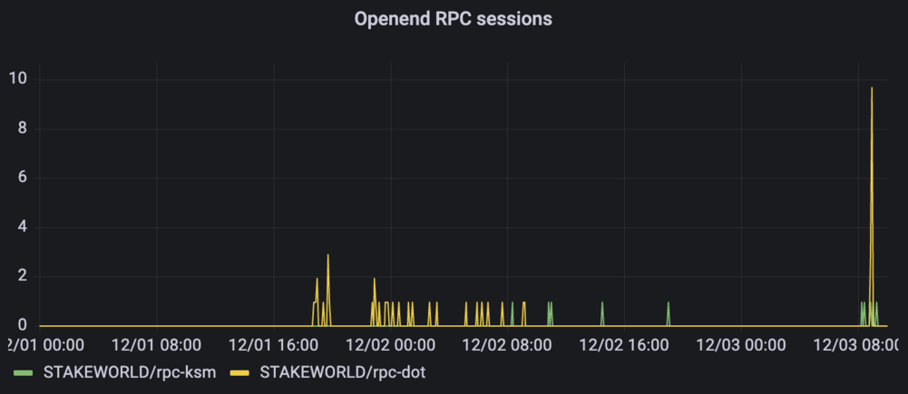
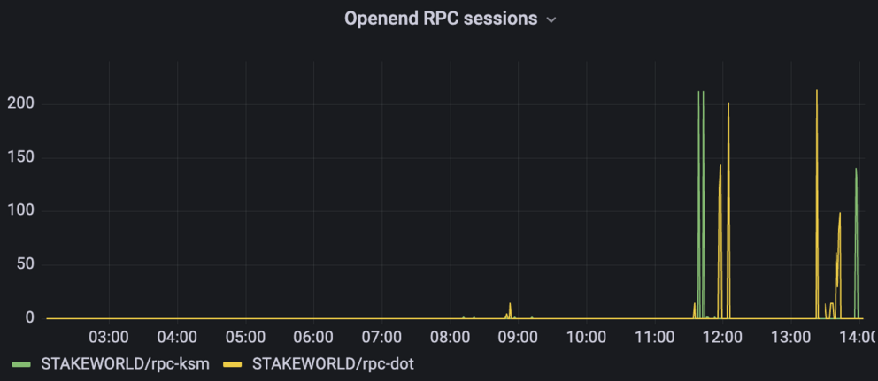
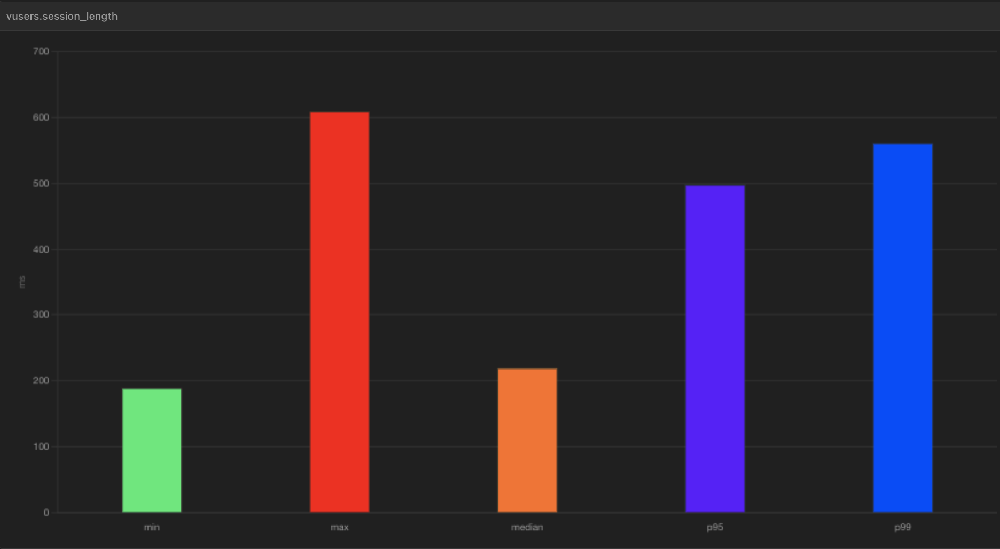
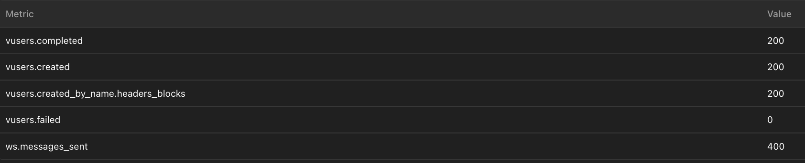

# Proposal: Stakeworld RPC nodes maintenance Q4 2022

Proponent: Et9M3rrA7H2kHQEGRXHxufcp9HTEmFirMWtKHvjoJ85r1C9 (identity: STAKEWORLD)

Date: 24.11.2022

Requested KSM: 38 KSM 

## Description
This request is for funding maintenace of stakeworld RPC services for kusama and polkadot. We originally proposed it as a tip just like the [snapshot service](/Q3-setup-maintenance.md) which was also submitted as a tip (as adviced by the council) but since Gov2 became active switched it to a request in the "Infrastructure maintenance bounty". 

## Context/problem/solution

### RPC nodes
RPC nodes are an essential part of the kusama/polkadot ecosystem since they give the possibility to interact with the chain. Stakeworld has been running 2 (pruned) public RPC servers ([dot.rpc.stakeworld.nl](http://dot.rpc.stakeworld.nl/) and [ksm.rpc.stakeworld.nl](http://ksm.rpc.stakeworld.nl/)) for a while now which were originally deployed for internal use and according to the logs also have found their way to some public use. We created a [pull request](https://github.com/polkadot-js/apps/pull/8227) for inclusion in the polkadot.js app but after reviewing earlier pulls, commits and remarks concluded that a full node was required so started setting up two full archive RPC nodes on high end hardware. We did some stress testing and finetuning and updated our [pull request](https://github.com/polkadot-js/apps/pull/8227) with updated info.  

## Technical
The RPC services are hosted on a high end dedicated server with nvme disk, 128Gb memory, unlimited network traffic on a 1 Gbit network link with nodes running in archive mode (`--state-pruning archive --blocks-pruning archive`). 

System and logs are monitored for errors, network problems and other issues. At this moment a pruned rpc service can quickly be deployed as backup in the case of failure of the main rpc. If funding allows we will setup more full nodes to create better fault tolerance and load balancing. 

## Metrics & stress testing
Grafana gives us some information about usage, at the moment mainly internal and testing use since the service is not yet very known. 

We did some stress testing using the [artillery substrate engine](https://github.com/dwellir-public/artillery-engine-substrate) created by experienced RPC maintainers from Dwellir which gave valuable insight in performance and also resulted in some tweaking of RPC's server cache and the web proxy server config. 

For example a test run asking the current block and hash with 25 connections per second and maximum 25 concurrent active users gave no problems and only slightly higher response times then lower loads. High concurence test gave connection errors which originated firstly from the web server settings and when those were corrected secondly from the `--ws-max-connections` node settings. We will continue to monitor these settings when there is more active use of the nodes.  

Other server parameters like systemload, iowait and memory usage were monitored during test but were all within normal parameters. 
 
## Publicity
There was some exposure through the kusama and polkadot validator pages on element and we are trying to include it on the polkadot.js website ([pull request](https://github.com/polkadot-js/apps/pull/8227)), getting selected from there and thus strengthening the dotsama ecosystem.

## Financial

### Expenses
This request is for 2 months of maintenance and hosting (so part of Q4).

Hours are included at a 80 EUR/hour rate.

| Item                  | Cost                   |
| ------------          | -----------------------|
| Maintenance           | 2 months x 4 h x 80 EUR = 640 EUR  |
| Hosting		| 2 months x 140 EUR = 280 EUR |
| TOTAL                 | EUR 920 / 0.9602 -> USD 958 [/25.23 (=EMA7)](https://kusama.subscan.io/tools/charts?type=price) = 38 KSM |
| REQUEST		| 38 KSM |

For simplicity treasury requests for our services will only be done on kusama.
