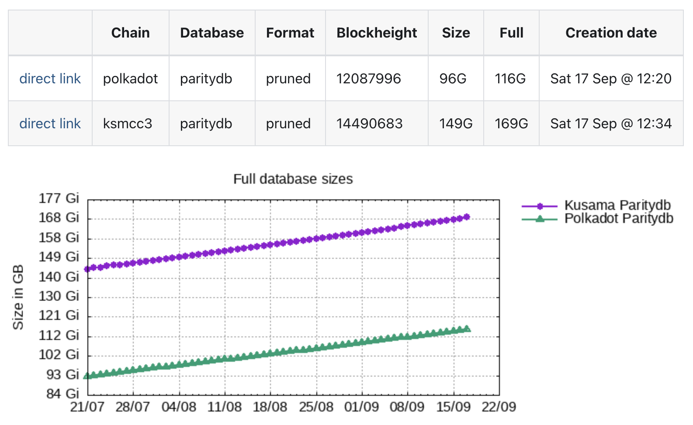
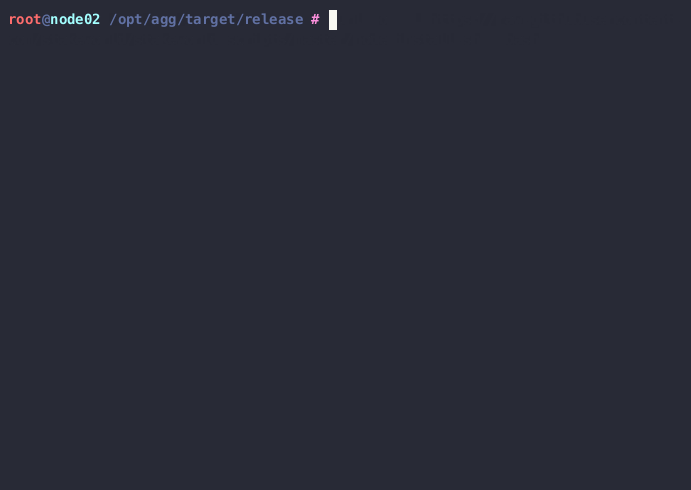
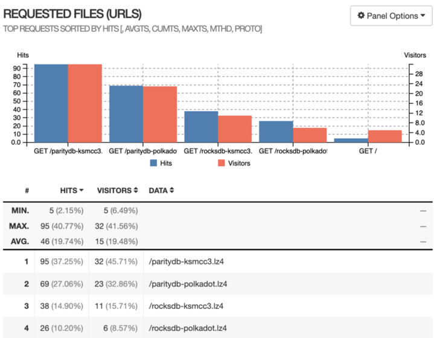

# Proposal: STAKEWORLD snapshot/install service maintenance Q4 2022

Proponent: Et9M3rrA7H2kHQEGRXHxufcp9HTEmFirMWtKHvjoJ85r1C9 (identity: STAKEWORLD)

Date: 12.11.2022

Requested KSM: 66 KSM 

## Description
This request is a continuation of [2022 Q3 Setup and maintenance Kusama Treasury Proposal](/Q3-setup-maintenance.md) (which was also submitted as a [tip](https://www.dotreasury.com/ksm/tips/14550098_0xbc345c7e0c82f5c59b9b4dd54037c9efbaed56cefe8cc0bb12c741bc5148e727) as adviced by the council) and asks for funding for hosting and maintenance of STAKEWORLD's snapshot service.

## Context/problem/solution

### Snapshot service
While setting up nodes for STAKEWORLD's services we often used snapshot services like polkachu or polkashots. Sometimes for testing or setting up a new node, also in the case of a database corruption or other problems a quick database restore is needed. While using these services there where some problems like non working links or slow connections. From the ideas of decentralisation and strengthening the ecosystem through multiple providers we thought it would be beneficial to add an extra [snapshot service](https://stakeworld.nl/snapshot). Also in the thousand validators group, in which we participate, it is encouraged to provide services to the community, like snapshot services, rpc nodes, etc. 


### Install/restore script
There are ansible scripts for installing a node but we think a simple one-line install script is more attractive so we also added an easy installer script which can restore a database, or even can install a complete node including snapshot with a simple command line installer. 

```bash
curl -o- -L https://raw.githubusercontent.com/stakeworld/stakeworld-scripts/master/node-install.sh | bash
```



### Open source
All the scripts and website sources are [open sourced on github](https://github.com/stakeworld/)

## Technical
The snapshot service is hosted on a dedicated server, with unlimited traffic, RAID protection and a 1 Gbit network link. We upgraded our service because of the higher demands after including the rocksdb snapshots. The server is monitored for (db) errors, network problems and other issues and every day the database is compressed and saved with an [open source crontab script](https://github.com/stakeworld/stakeworld-website/blob/master/scripts/snapshot.sh). Occasionaly we start with a freshly synced database to reduce disk space an prevent errors. The script also registers blockheight, full and compressed datasizes, creates a gnuplot image and puts it all on the [website](https://stakeworld.nl/snapshot).

## Usage
Parsing the log files and excluding our own ip's in the period 27/AUG/2022 — 10/NOV/2022 the following usage was observed:




## Publicity
Main publicity is through the kusama and polkadot validator pages on element. We try to drop the snapshot website or install script when there are questions with a relation to this and are actively participating on these forums.  

Also we made a wiki pull request to include ourself in the snapshot providers on the [how-to-validate](https://guide.kusama.network/docs/maintain-guides-how-to-validate-polkadot/) wiki page, which was accepted and is now online.

The website is SEO friendly, findable in google searches and slowly increasing in rank.

## Future
We will continue with this service and are [exploring](https://github.com/polkadot-js/apps/pull/8227) setting up [https://stakeworld.nl/docs/rpc](public RPC node's for kusama and polkadot).

## Financial

### Previous tips
In Q3 the following tips were granted:
* 62 KSM was granted for [2022 Q3 Setup and maintenance Kusama Treasury Proposal](/Q3-setup-maintenance.md)  
* 9 KSM was granted for the [snapshotservice](https://www.dotreasury.com/ksm/tips/13427182_0x47212d8518c0c5192db5c7321cab048ba9ae096cef61f7956c9203fd8ab5bc54)
* 5 KSM was granted for the [installer script](https://www.dotreasury.com/ksm/tips/14186624_0x0ad5023d326bd74fb1a3061d1402a903852811ec76b846828d5619a0e37448c0)

### Expenses
This request is for 3 months (Q4) of hosting, maintenance and adding functionality (like the rocksdb support).

Hours are included at a 80 EUR/hour rate.

| Item                  | Cost                   |
| ------------          | -----------------------|
| Maintenance           | 3 months x 4 h x 80 EUR = 960 EUR  |
| Finetuning/script updates    | 3 months x 2 h x 80 EUR = 480 EUR     |
| Server rent		| 3 months x 140 EUR = 420 EUR |
| TOTAL                 | EUR = 1860 -> USD 1928 [/29.1 (=EMA7)](https://kusama.subscan.io/tools/charts?type=price) = 66 KSM |
| REQUEST		| 66 KSM |

For simplicity treasury requests for our services will only be done on kusama.
